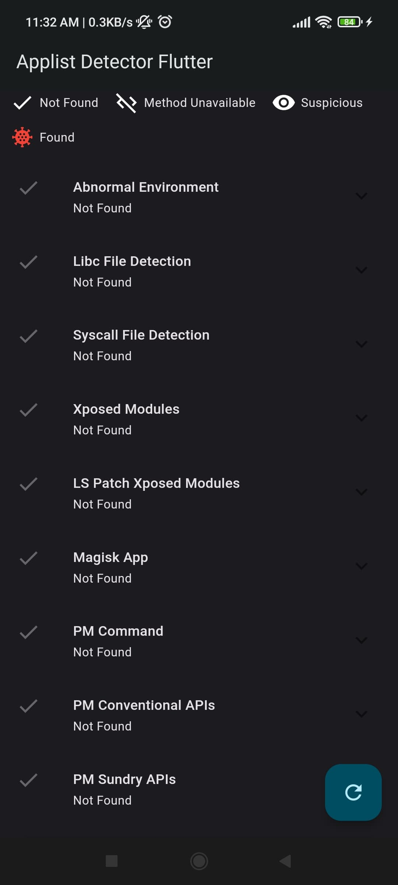
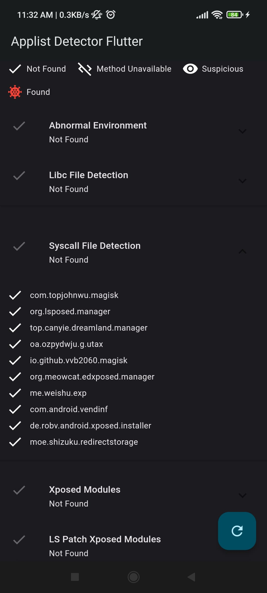
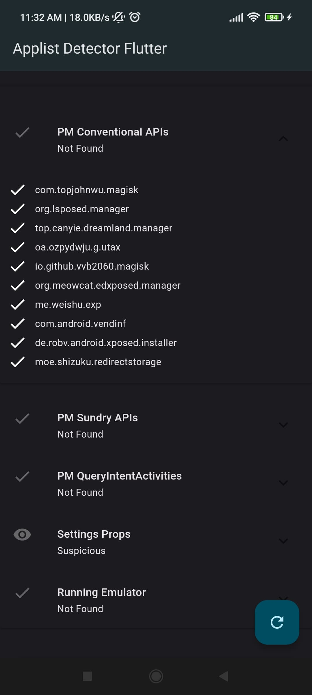
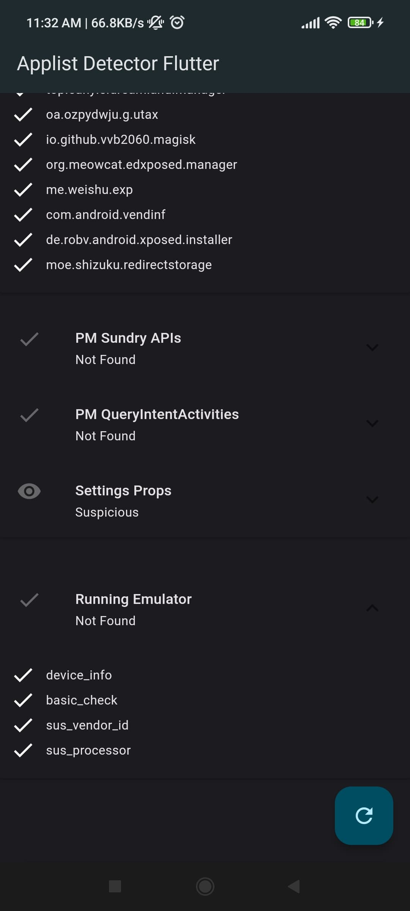

# Applist Detector Flutter

A Flutter ported library to detect suspicious apps like Magisk manager, Xposed framework, Abnormal Environment, running emulator and much more. Written in Kotlin and Dart ❤️.

**This is not an officially supported Google product**

|   |   |   |   |
|---|---|---|---|
|  |  |   |   |

## Platform Support

| Android | iOS | MacOS | Web | Linux | Windows |
| :-----: | :-: | :---: | :-: | :---: | :-----: |
|   ✅    | ❌  |  ❌   | ❌  |  ❌   |   ❌    |

## Features

- Search for suspicious files in the files in the system.

- Check for abnormal environment for running suspicious apps like Magisk, Riru, or Zygisk.

- Check if the app is running on an emulator like Genymotion, Bluestacks, Windows subsystem for android, etc.

- Check if the Xposed framework is installed.

- [Play Integrity API](https://developer.android.com/google/play/integrity) Checker which helps protect your apps and games from potentially risky and fraudulent interactions, such as cheating and unauthorized access, allowing you to respond with appropriate actions to prevent attacks and reduce abuse.

### Disclaimer

This tool is intended to be used by individuals to make it easy to secure your app for a large extend and it is **NOT 100% bulletproof**.

### Credits

- [Dr-TSNG/ApplistDetector](https://github.com/Dr-TSNG/ApplistDetector)

- [byxiaorun/Ruru](https://github.com/byxiaorun/Ruru)

- [1nikolas/play-integrity-checker-app](https://github.com/1nikolas/play-integrity-checker-app)

### Contribution

Feel free to contribute to this project by creating issues or pull requests. Any help is appreciated ❤️. Check out the [CONTRIBUTING.md](./CONTRIBUTING.md) file for more info.

> Contribution guide will be added soon.

#### License

This library is distributed under Apache 2.0 license for more info see [LICENSE DETAILS](./LICENSE)
